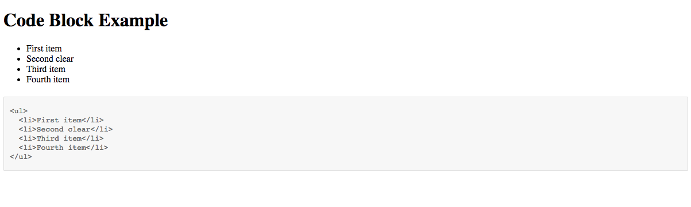
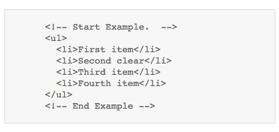
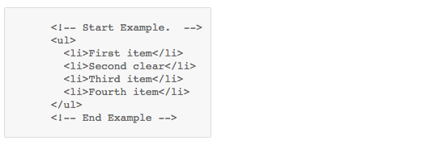
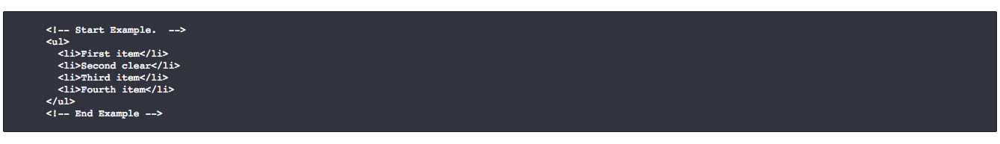
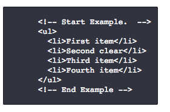

# evo-code-block

## Summary

Block that will show multiple lines of code. It looks for an identifier and then grabs the html.  

#### Dependency
* Jquery - Reference it in the document.  Any path could be used so if the jQuery files are local just adjust the path to fit.
````shell
<script src="https://code.jquery.com/jquery-3.1.1.min.js"></script>
````

## Setup 

* Wrap the HTML you want to show with a div tag that has the class "evo-codeblock".  That div will need an identifier which will be called "data-identifier".  The identifier is how it will link to the target box that shows it.  The codeblock displaying the HTML will have an attribute "data-target" that must match the identifier of the section you want to show in the block. See example below.

* Add the reference to the stylesheet and set it's pathway.

* Add the reference to the javascript file and set it's pathway.

* **Important** note on formatting

    Because we are grabbing html right from the file, the code being shown does need some formatting considerations.  Specifically, **if the code is indented in the file then the indentation will be applied when showing in the box as well**.  In order to have the code tight to the left side of the codeblock the code itself will need to start out unindented in the file.

####Examples

######Setting up the identifier / target pairing to display code in the code box.
The main focus is on the identifier/target pairing.  The identifier marks the section and then that code will get placed in the matching target.

````shell
data-identifier="list"
data-target="list"
````

In the example below the identifier is set to "list".  The div is placed around the HTML you want to display.  Everything within that div will then be displayed in the target codeblock. 
````shell
<!-- Start Example -->
<div class="evo-codeblock" data-identifier="list"><!-- the identifier is set there -->
  <ul>
    <li>First item</li>
    <li>Second clear</li>
    <li>Third item</li>
    <li>Fourth item</li>
  </ul>
</div>
<!-- End Example -->
````
Then the codeblock with a data-target to match the identifier will show the HTML.  A div with a pre tag and then code tage inside to format the html.

````shell
<!-- the identifier is matched by the class in the codeblock's target.  The position needs to stay the same.  After codeblock, before target -->
<div class="evo-codeblock-target" data-target="list">
    <pre>
        <code>
            <!-- HTML will show up inside here -->  
        </code>
    </pre>
</div>
````

######Setting up the button to reveal / hide the code block.

The button needs to be inside the same div as the block it will be revealing.  The HTML structure to this is very important. It looks for the class of "hidden-block".  The block itself is set up like every other block.  The code tag just needs the class "hidden-block" to be hidden.  The button needs a class of "evo-multiline-reveal-button" in order to trigger the reveal /hide behavior.

````shell
<!--  The data target needs to match the html section it is supposed to be showing. -->
<div class="evo-codeblock-list evo-codeblock-target" data-target="list3">
  <button class="example-button evo-multiline-reveal-button">view code</button>
  <pre>
    <code class="hidden-block">
      <!-- code gets put in here -->
    </code>
  </pre>
</div>
````


## Code tag classes
This code tag can have all the same classes as the [inline code block](https://github.com/labelle/evo-code-inline).

>No class on the code tag fullscreen



>No class on the code tag small screen




>class="nowrap" on the code tag removes text wrapping causing the box to scroll if needed.


>class="short" on the code tag



>class="darktheme" on the code tag



>class="darktheme short" on the code tag



######Extra classes for the multiline code block

>class="fixheight" on the code tag sets a max-height of 465px.  The box will then scroll.
````shell
<code class="fixheight">
  <!-- code gets put in here -->
</code>
````
>class="hidden-block" on the code tag hides the block.  This class will be toggles with a class called revealed when showing / hiding the box.
````shell
<code class="hidden-block" data-target="list2">
  <!-- code gets put in here -->
</code>
````
>class="evo-multiline-reveal-button" is the class the button in charge of showing/hiding the codeblock needs.
````shell
<button class="example-button evo-multiline-reveal-button">view code</button>
````
>class="evo-remove-this" is the class that, when added to the code reveal button, will cause the button to be removed from the page.  A page refresh is required in order to bring it back. 
````shell
<button class="example-button evo-multiline-reveal-button evo-remove-this">view code</button>
````
## Structure

#### Index.html
> Contains an example of an html section wrapped with the identifer needed.

#### codeblock.js
> Contains the javascript needed to put the code into the codeblock on page load.

#### codeblock-style.css
> Contains the styles used

## Screenshot


